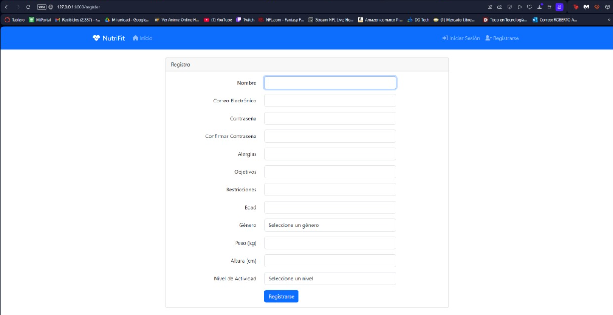
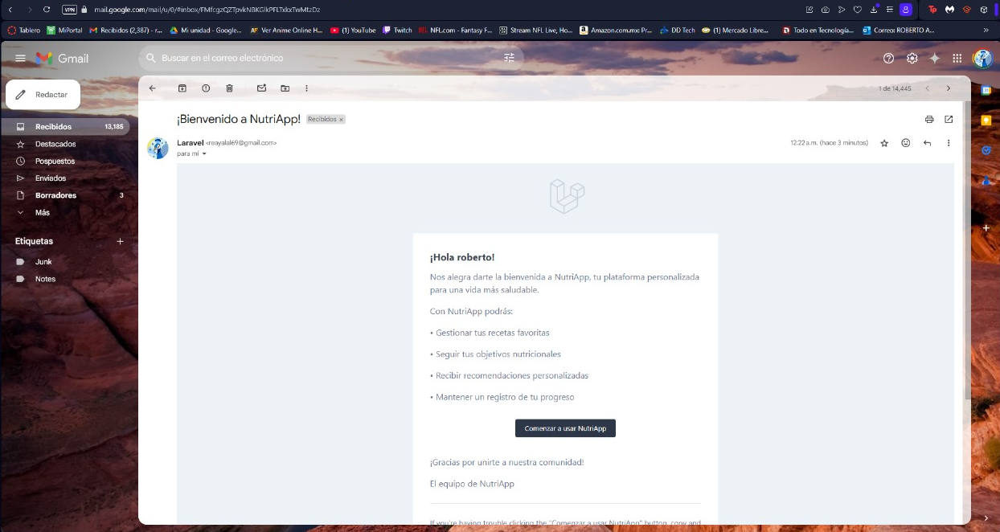
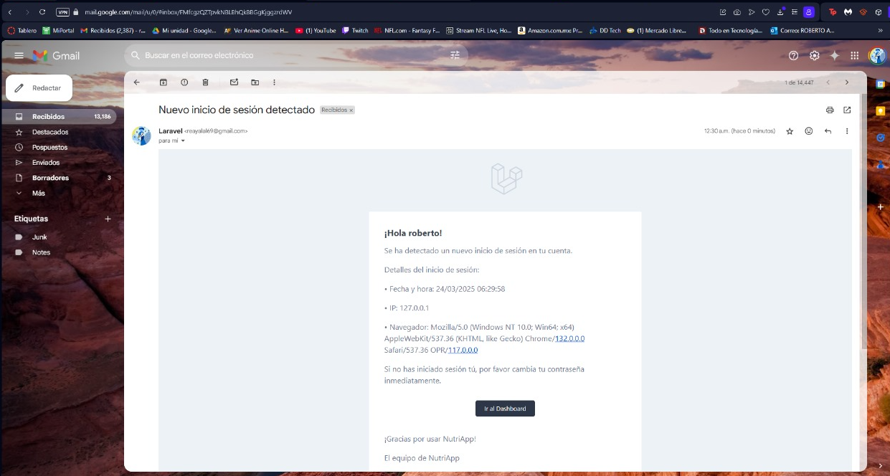
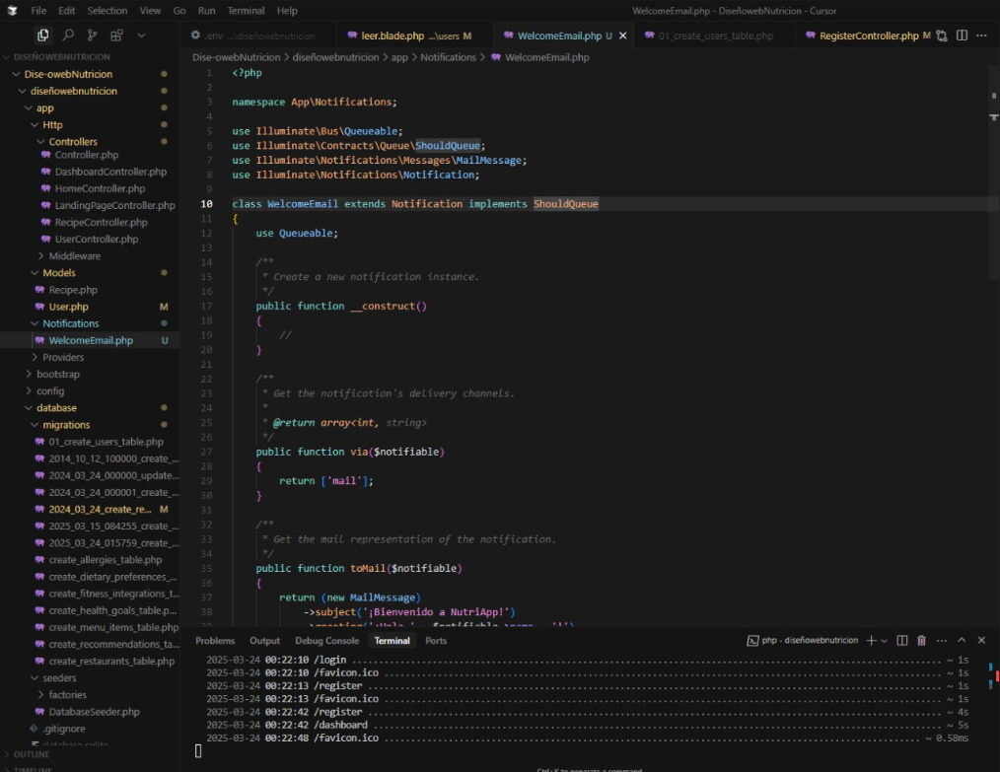
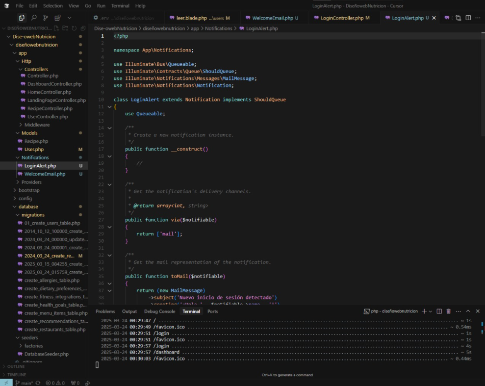
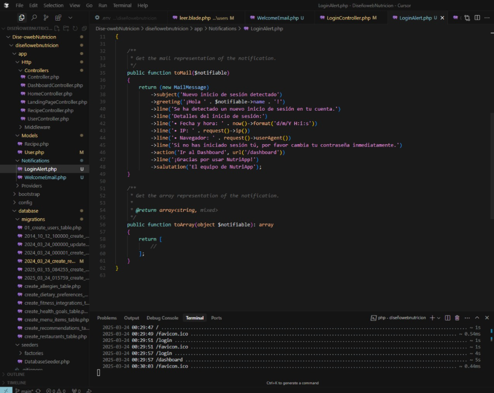

# Project Name

## User Interface Screenshots

### Authentication Views

| Guest View | Authenticated User View |
|------------|-------------------------|
|  |  |

### Authentication Pages

| Login Page | Registration Page |
|------------|-------------------|
|  |  |

### Navbar Differences

| Guest Navbar | User Navbar |
|--------------|-------------|
|  |  |

### Email and Alerts

| Welcome Email | Login Alert |
|---------------|-------------|
|  |  |

## Code Implementation

### Welcome Email Code

### Login Alert Code

